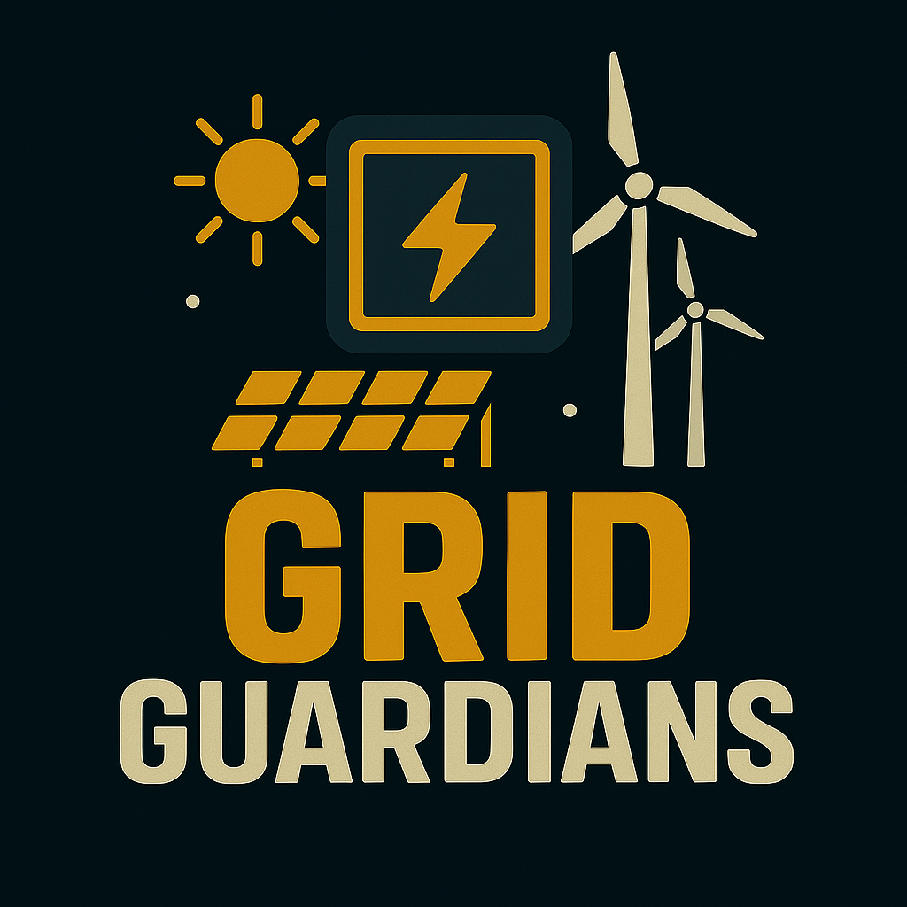

## Play Online

🎮 **[Play Grid Guardians Online](https://abuters.github.io/grid-guardians/)** 


# Grid Guardians

> 
*A decarbonisation-themed arcade defense game.*

---

## Game Overview

**Grid Guardians** is an educational and action-packed arcade game where you defend a modern electrical grid from waves of fossil fuel emissions. As the grid, you must dodge, shoot, and power up to protect renewable infrastructure and push back against pollution. The game features a vibrant outdoor environment, realistic wind turbines and solar farms, and a dramatic boss battle against a fossil fuel power plant.

> **Screenshots:**  
> 

---

## Controls & Gameplay Mechanics

- **Move:** Arrow keys (Up, Down, Left, Right)
- **Shoot:** Spacebar
- **Restart:** R
- **Collect Power-Ups:** Touch falling batteries to gain temporary abilities

### Power-Ups
- **AA Battery:** All power-ups are now realistic AA batteries
  - **Triple Shot:** Fire three bolts at once
  - **Speed Boost:** Move faster
  - **Shield:** Temporary invulnerability

### Enemies
- **Coal Chunks:** Menacing, angry-faced coal with jagged shapes and fangs
- **Gas & Diesel Emissions:** Toxic clouds and oil blobs
- **Boss:** A massive, scary fossil fuel power plant with multiple angry faces

### Environment
- **Background:** Sunny sky, animated clouds, horizon, and ground
- **Renewables:** Realistic wind turbines (blue, detailed) and solar farms (detailed panels, fencing, connections)
- **UI:** Modern panels, progress bars, power-up timers, and a polished game over screen

---

## Technical Implementation

- **Language:** JavaScript (ES6+)
- **Framework:** [p5.js](https://p5js.org/) for rendering and game loop
- **Single-file HTML:** All logic in `index.html` for easy deployment
- **No dependencies:** Only `p5.min.js` is required

### Key Features
- **Object-Oriented Design:** Classes for Player, Enemy, PowerUp, Particle, Explosion, etc.
- **Custom Drawing:** All visuals are rendered with p5.js drawing commands (no image assets)
- **Animations:** Smooth movement, explosions, damage flashes, and environmental effects
- **Thematic Consistency:** All visuals and mechanics reinforce the decarbonisation theme

---

## Development Process Using AI Tools

This game was developed with the assistance of advanced AI coding tools, which enabled:
- **Rapid Prototyping:** Fast iteration on gameplay, visuals, and mechanics
- **Thematic Overhaul:** Transforming a space shooter into a decarbonisation/energy defense game
- **Visual Polish:** AI-generated code for realistic wind turbines, solar farms, and enemy designs
- **Feature Expansion:** Adding new power-ups, UI elements, and accessibility improvements
- **Code Review:** AI-assisted refactoring and bug fixing

**AI tools used:**
- Code generation and refactoring
- Thematic brainstorming and visual design
- Automated documentation and planning

---

## Running & Testing

1. **Open `index.html` in your browser.**
2. **Play!** No build step required.

### Unit Testing

For logic testing, consider using [Jest](https://jestjs.io/) or [Mocha](https://mochajs.org/).  
Example test file structure:
```
/__tests__/game.test.js
```
(See the codebase for sample tests.)

---

## Credits

- **Game Design & Code:** [Your Name]
- **AI Coding Assistant:** OpenAI GPT-4
- **Framework:** p5.js

---

## License

MIT License

---

*Add your own screenshots to the `screenshots/` folder and update the image links above!* 
